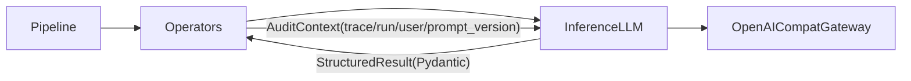

# Inference 模块设计（LLM 为核心）

本文档描述 `backend/foundation/platform_foundation/inference/` 的设计目标、目录结构与接口约定，重点覆盖 **LLM（OpenAI-compatible 网关）** 的统一封装方式。

## 背景与定位

`platform_foundation` 的核心约束是“算子/编排/推理能力”分层清晰，避免循环依赖与能力散落：

- **依赖方向**：`pipeline → operators → inference`（单向）
- **operators**：承载业务核心逻辑；需要外部推理能力时，通过 inference 提供的客户端调用（不要在算子内直接绑定某家 SDK）。
- **inference**：提供可替换的推理能力封装（LLM/OCR 等），统一：鉴权、超时、重试、结构化输出校验、审计打点、可观测性。

> 当前仓库中 `inference/__init__.py` 仍为空壳，本文档用于指导后续落地实现。

---

## LLM 目标与非目标

### 目标

- **单入口**：算子只依赖 `LLMClient`（或其少量稳定入口），通过配置 `base_url + model` 切换不同模型/网关。
- **强结构化输出**：使用 OpenAI-compatible `responses` API 的 `response_format=json_schema`，将模型输出严格约束为 JSON，并用 Pydantic 再校验。
- **审计优先**：每次调用都注入并记录 `trace_id/run_id/.../user_id` 等审计字段（与 `platform_foundation/contracts/pdf_items.py` 对齐）。
- **可测试**：提供 `FakeLLMTransport`/`FakeLLMClient`，单测无需真实网关。
- **可复现**：除 `prompt_name/version` 外，额外记录 **输出 JSON Schema 的 hash**（`output_schema_hash`），防御 Pydantic 模型升级导致的契约漂移。
- **可回放**：记录 **prompt 内容 hash**（`prompt_hash`）与 **渲染后 prompt hash**（`rendered_prompt_hash`），并引入统一 `request_fingerprint` 作为日志主键/缓存主键/快照关联键。
- **SDK 优先**：底层优先复用 OpenAI 官方 SDK（及其 OpenAI-compatible 生态，如 vLLM 网关），减少自研 HTTP/字段映射与基础校验成本。

### 非目标（当前阶段不做）

- 不设计多家原生 SDK provider（如 Anthropic/Azure 专用 SDK）；仅 OpenAI-compatible 网关。
- 不在 `foundation` 内做持久化（DB）或分布式队列编排（Celery/Ray driver 在上层业务服务实现）。
- 不把所有 prompt “硬编码在算子中”；prompt 需集中、版本化、可追溯。

---

## 建议目录结构

在 `backend/foundation/platform_foundation/inference/` 下新增 `llm/` 子包（以“复用 OpenAI SDK”为前提，尽量减少模块数量）：

```text
backend/foundation/platform_foundation/inference/
  __init__.py

  llm/
    __init__.py
    contracts.py          # SSOT：AuditContext / CachePolicy / PromptSpec（Pydantic）
    client.py             # LLMClient：审计/预算/缓存/结构化校验 + 通过 OpenAI SDK 发起调用
    transport_sdk.py      # （可选）SDK 适配层：封装 OpenAI SDK 调用与异常映射

    prompts/
      __init__.py
      registry.py         # prompt_name + prompt_version -> PromptSpec
      pdf_sensitive_spans.py
      pdf_risk_grade.py

    testing/
      __init__.py
      fake_client.py      # 单测 stub：给定输入返回固定结构化结果
```

说明：

- **contracts**：保留最关键的 SSOT：审计、缓存策略、PromptSpec（含 inputs/output Pydantic 绑定）。
- **client**：承载本模块的差异化策略（审计/预算/缓存/结构化输出健壮性）。底层调用优先走 OpenAI SDK，从而复用其请求结构校验、连接管理与基础异常类型。
- **transport_sdk（可选）**：当你希望进一步把“SDK 调用细节”与“策略层 client”解耦时引入；否则可直接在 `client.py` 中调用 SDK。
- **prompts/registry**：集中化 prompt 模板与版本管理；审计时记录 prompt 版本。

---

## 接口设计

### 1) `contracts.py`（SSOT）

在“优先复用 OpenAI SDK”的前提下，`contracts.py` 建议只保留必须稳定的 SSOT（其余请求/响应结构尽量复用 SDK 类型/返回结构）：

- **审计上下文**：`AuditContext`
- **PromptSpec**：`prompt_name/version` + `inputs_model` + `output_model` + 模板
- **缓存策略**：`CachePolicy`（enabled/ttl/scope）
- （可选）**轻量统计结构**：如需跨 SDK/网关统一的 `usage`/`latency` 结构，再引入

> 请求/响应的“物理结构”（messages、response_format、request_id、finish_reason、usage 映射等）优先交给 OpenAI SDK 处理；本文档建议仅对必要字段进行“读取与审计记录”。

### 2) 审计上下文（AuditContext）

建议在 `contracts.py` 定义一个最小审计结构，来源包括：

- `OperatorContext`: `trace_id/run_id/config_version/tags`
- SSOT items（例如 PDF）：`archive_id/doc_id/page_index` + `*_user_id`（见 `contracts/pdf_items.py`）

最小字段建议：

- `trace_id`, `run_id`
- `archive_id`, `doc_id`, `page_index`（可选）
- `triggered_by_user_id`, `archive_owner_user_id`, `detected_by_user_id`, `confirmed_by_user_id`（按场景填）
- `prompt_name`, `prompt_version`
- `prompt_hash`（对 system/user/few-shot/tools 等 prompt 内容做 hash；防止同 version 被修改导致不可复现）
- `rendered_prompt_hash`（对 render 后的最终 messages/text 做 hash；用于缓存与回放定位）
- `output_schema_hash`（对 `output_model.model_json_schema()` canonicalize 后取 hash，用于契约可复现）
- `request_fingerprint`（建议：统一请求指纹，作为 cache key/log key/snapshot key 的共同主键）
- `is_truncated`（输入被裁剪/截断时标记；并建议记录原始长度与裁剪后长度）
- `input_hash_original` / `input_hash_effective`（trim 前 vs trim 后；避免“上游以为处理 A，实际处理 B”不可解释）
- `op_name`, `op_version`（调用方算子身份）

落地方式建议：

- **网关 metadata**：若网关支持 `metadata`（OpenAI Responses 支持），将上述字段写入。
- **结构化日志**：`LLMClient` 在本地日志记录同样的字段（避免网关不回传 metadata）。
- **Payload Snapshot（强审计可选）**：将原始请求/响应 JSON 作为 `ArtifactRef` 存对象存储，并把其 `uri` 记录到本地日志与/或 AuditContext（见“审计与可观测性”）。

---

### AuditContext 的稳定性建议：不可变 + Builder

为避免审计字段在调用链中被中途修改或不一致，建议 `AuditContext` 在实现上满足：

- 不可变（例如 `@dataclass(frozen=True)` 或 Pydantic frozen model）
- 提供 builder/with_xxx 风格方法：
  - `ctx = ctx.with_prompt(prompt_name, prompt_version, prompt_hash, rendered_prompt_hash, output_schema_hash)`
  - `ctx = ctx.with_model(model, base_url)`
  - `ctx = ctx.with_budget(is_truncated, original_chars, trimmed_chars, input_hash_original, input_hash_effective)`

该约定能显著提升审计链路的“底座稳定性”。

---

## Prompt 模板化与 PromptInputsModel（强约束输入）

本设计选择了强结构化输出（`responses` + `response_format=json_schema`）。为避免“prompt 变量缺失/错名”导致输出漂移，建议在 prompt 层同时强约束 **输入变量**。

### 核心对象：`PromptSpec[Inputs, Outputs]`

`prompts/registry.py` 不返回最终字符串，而返回一个可渲染的 `PromptSpec`（概念）：

- **识别与审计**
  - `prompt_name`: 稳定标识
  - `prompt_version`: 语义版本（必须入审计）
- **模板**
  - `system_template`: str（含占位符）
  - `user_template`: str（含占位符）
- **可选增强（预留扩展点）**
  - `few_shots`: list[dict] | None（用于分类/抽取质量提升，必须计入 `prompt_hash`）
  - `tools`: list[dict] | None（预留工具调用结构；必须计入 `prompt_hash`）
- **输入强约束**
  - `inputs_model`: `Type[BaseModel]`（PromptInputsModel，用于校验算子注入的运行时变量）
- **输出强约束**
  - `output_model`: `Type[BaseModel]`（用于生成 JSON Schema，且对网关返回做 Pydantic 二次校验）
- **hash 与指纹（建议由 PromptSpec/LLMClient 提供工具方法）**
  - `prompt_hash()`：基于 templates + few_shots/tools + canonical_json(output_schema) 计算
  - `rendered_prompt_hash(rendered)`：基于 render 后的最终 messages/text 计算
  - `request_fingerprint(rendered, model, params, output_schema_hash)`：统一请求指纹

### 渲染（render）流程

调用链推荐如下：

1. **算子准备运行时变量**（业务逻辑在算子中）
2. `inputs = PromptInputsModel.model_validate(runtime_vars)`（fail-fast：缺字段/错类型立刻报错）
3. `rendered = PromptSpec.render(inputs)` 产出 OpenAI SDK 所需的 messages/text（由 client/transport 适配到 `responses` 请求参数）
4. `LLMClient` 基于 `PromptSpec.output_model` 生成 JSON Schema，填入 `response_format=json_schema`
5. 网关返回后 `LLMClient` 使用 `output_model` 二次校验，得到强类型结果

> 模板引擎建议从简单开始：先用 `str.format`（无依赖、变量缺失直接异常）；若后续需要条件/循环，再引入 Jinja2。

### 预留接口（中期能力）

即使第一版不实现，也建议在 `LLMClient`/Prompt 侧预留接口形态，避免未来重构：

- `run_stream(...)`：流式输出（适配 agent/长文本）
- 多模态输入：inputs/content 预留 `type: "text" | "image"` 的表达（如未来接入 Qwen-VL）

### 输入预算与截断（Budgeting & Trimming）

PDF OCR 文本可能极长。为避免 `finish_reason=length` 导致结构化输出被截断，建议把“预算与裁剪”做成 LLM 层 SSOT 行为：

- 在 `PromptInputsModel` 中加入与预算相关的字段或约束（示例）：
  - `max_input_chars`（硬截断字符数；起步可用）
  - 或 `estimated_tokens`（更准确，但需要 tokenizer 估算）
- 在 `LLMClient` 发起请求前统一执行 trim，并写入审计字段：
  - `is_truncated: bool`
  - `original_input_chars: int`
  - `trimmed_input_chars: int`

> 说明：预算策略属于推理能力的一部分，应在 `LLMClient` 统一实现，避免各算子重复与不一致。

---

## `LLMClient` 行为约定（`client.py`）

算子侧最理想的调用形态是：

- 算子负责业务流程与输入准备（如从 `PageItem.text`/`text_artifact_ref` 得到文本）。
- 算子调用 `LLMClient.run_structured(prompt_spec, inputs, audit_ctx, ...)`（示例名；其中 `inputs` 为 PromptInputsModel 实例或可验证 dict）。

### 必备能力

- **超时**：每次请求必须有 timeout（避免算子卡死）。
- **重试**：对网络错误、429、5xx 做有限重试（指数退避 + jitter）。异常分类可优先复用 SDK 的异常类型，再映射为统一错误码（便于算子处理）。
- **强结构化输出**：要求网关按 `response_format=json_schema` 输出；拿到结果后仍需 Pydantic 再校验。
- **错误分类**：
  - `RateLimitError`（可重试）
  - `TransientGatewayError`（可重试）
  - `SchemaMismatchError`（通常不可重试；可选进行一次“修复重试”策略，见下）
  - `TokenLimitExceededError`（不可重试；通常需要缩短输入/提高输出预算/换长上下文模型）
  - `BadRequestError`（不可重试）
- **可观测性**：记录 `latency_ms`、`usage`、`model/base_url`、`request_id`、`prompt_name/version`。
- **fallback（可选但推荐）**：同一业务动作可以配置多个 `{base_url, model}`，失败时切换下一候选。

### ExecutionPolicy（策略外置，强烈建议）

随着业务增长，`LLMClient` 内部策略（retry/timeout/fallback/cache/trim）会快速膨胀。建议在接口上引入可选的策略对象：

- `ExecutionPolicy`（概念）：
  - `timeout_seconds`
  - `retry_policy`（最大次数、退避、可重试错误集合）
  - `fallback_models`（可选）
  - `cache_policy`（可选；见缓存章节）
  - `budget_policy`（裁剪策略/上限）

并允许算子按场景传入：

- `LLMClient.run_structured(..., policy=ExecutionPolicy(...))`

这样便于：
- 不同算子使用不同策略
- 灰度/AB test/按环境切换策略

### 结构化输出的“修复重试”（可选）

即使强依赖 `json_schema`，仍可能出现网关返回格式不符合预期或解析失败。建议保留一个最小修复策略：

- 第一次失败：记录原始输出（hash 或 ArtifactRef），再以更严格提示重试一次（例如“只输出合法 JSON，不要额外文本”）。
- 第二次失败：抛 `SchemaMismatchError`，交由算子决定降级/失败。

#### `finish_reason=length` 的处理（关键）

若网关返回 `finish_reason == "length"`（或等价信号），说明输出因 token 预算耗尽被截断：

- 此时 JSON 极可能不完整，**不应触发“修复重试”**（重试通常无用且浪费配额）
- 应直接抛 `TokenLimitExceededError`，提示上游调整：
  - 缩短输入（更强裁剪/分段）
  - 增大 `max_output_tokens`
  - 或切换更大上下文窗口的模型

同时建议在日志与/或 AuditContext 记录诊断字段（便于一次定位预算问题）：

- `finish_reason`
- `input_tokens` / `output_tokens` / `max_output_tokens`
- `original_input_chars` / `trimmed_input_chars`

---

## Prompt 版本化（`prompts/registry.py`）

为满足审计与可回滚，prompt 必须显式版本化：

- `prompt_name`: 稳定标识（例如 `pdf_sensitive_spans`）
- `prompt_version`: 语义版本（例如 `1.0.0`）
- `system_template` / `user_template`: 模板字符串（建议支持简单 format）
- `inputs_model`: PromptInputsModel（算子注入运行时变量前，先做 Pydantic 校验）
- `output_model`: Pydantic 模型（用于生成 JSON Schema & 校验）

`LLMClient` 调用必须显式带 `prompt_name/version`，并写入审计字段。

---

## 传输层（Transport）与客户端（Client）的职责边界

虽然当前仅对接 OpenAI-compatible 网关，不同厂商/版本对 `response_format` 等细节支持可能存在差异。建议按以下边界解耦“物理传输”与“业务逻辑”：

- **SDK Transport（`transport_sdk.py`，可选）**
  - 负责：调用 OpenAI SDK（设置 `base_url/api_key/model/timeout`）、透传 `response_format=json_schema`、抽取 `finish_reason/request_id/usage` 等关键字段、将 SDK 异常映射为基础异常
  - 不负责：业务级重试策略、输入预算裁剪、prompt 渲染、审计字段选择、输出校验策略
- **LLMClient（`client.py`）**
  - 负责：prompt 渲染（含 PromptInputsModel 校验）、审计上下文注入、预算裁剪与 `is_truncated` 记录、重试/退避、fallback、结构化输出校验与错误分类

该分层允许未来在不影响算子与 prompt 的情况下，扩展：
- `json_schema` → `json_object` 的降级策略
- 多个 base_url 的路由与健康探测

---

## 与 operators 的集成方式

你提出的偏好是：**算子承载核心逻辑**，LLM 是算子在需要时调用的推理能力。这在本架构下的推荐集成方式：

- 算子内部持有（或注入）`LLMClient` 实例
- 从 `OperatorContext` + `PageItem/SensitiveSpanItem/...` 构建 `AuditContext`
- 调用 `LLMClient` 获得结构化结果（Pydantic model）
- 将结果映射回 SSOT items（例如 `SensitiveSpanItem`），并填充审计字段（`detected_by_user_id/detected_at/detection_actor` 等）

这样做的好处是：业务流程仍在算子中，但 LLM “公共逻辑”不会重复实现。

---

## 依赖与配置注入

由于 `foundation` 要保持纯 Python、可在不同服务复用，建议：

- `LLMClient` 通过显式构造参数注入：`base_url`、`api_key`、默认 model、timeout、重试策略等
- `OperatorContext.tags` 可作为补充配置入口（例如 `prompt_version_override`、`model_override`），但不应成为唯一配置来源
- 不在 inference 内读取全局环境变量（由上层服务在创建 client 时注入）

---

## 测试策略（`testing/fake_transport.py`）

建议实现 `FakeOpenAIResponsesTransport`：

- 输入（model + prompt_name/version + input text）→ 输出固定 JSON（或故意错误 JSON）
- 覆盖：
  - schema 校验成功/失败
  - 重试路径（429/5xx）
  - 审计字段是否被传递到 request metadata 与日志事件

---

## 审计与可观测性（Audit & Observability）

为满足合规与可复现排障，建议采用“双链路”记录：

1. **Call Log（本地结构化日志）**
   - 必填：`trace_id/run_id/op_name/op_version/prompt_name/prompt_version/output_schema_hash/model/base_url/latency_ms/usage/is_truncated`
   - 不建议：直接打印全文 OCR 或完整模型输出（可仅记录 hash/截断）
2. **Payload Snapshot（远端/对象存储，强审计可选）**
   - 将原始请求/响应 JSON 作为 `ArtifactRef` 写入对象存储（S3/OSS/本地存储）
   - 在日志与/或 AuditContext 中记录 `ArtifactRef.uri`，供审计回放

> 注意：Payload Snapshot 涉及敏感信息，必须结合脱敏/加密/访问控制策略。

---

## LLM Cache（控成本）

在研发/测试阶段与部分生产场景中，LLM 调用可能出现大量重复请求（相同输入、相同 prompt、相同模型与参数）。为了降低 GPU/网关成本、提升吞吐，`LLMClient` 建议内建可选缓存能力。

### 设计目标

- **降低成本**：N 分钟内重复请求直接命中缓存，避免重复推理。
- **行为可控**：由业务/算子显式声明“是否允许缓存”与 TTL（时间敏感任务可禁用）。
- **合规可审计**：缓存命中也必须记录审计字段，避免“未调用网关却返回结果”不可解释。

### 适用与禁用场景（建议）

- **适用（可缓存）**
  - 错别字/规范化/分类分级等相对确定性任务
  - `temperature=0` 或近似确定性配置
  - 结构化抽取（强 `json_schema` + Pydantic 校验）且输出受 prompt 与 schema 版本约束
- **禁用（不缓存或必须显式 opt-in）**
  - 强时效：依赖“当前时间/最新规则/外部实时信息”的推理
  - 输出包含高敏感信息且缓存落盘/共享存在泄露风险
  - 明确要求多样性或探索性生成（高 temperature）

### 缓存策略由业务控制（推荐接口形态）

建议支持两种控制入口（可二选一，也可同时支持）：

1. **算子调用侧显式控制**
   - `cache_policy=CachePolicy(enabled=True, ttl_seconds=600, scope="doc")`
2. **PromptSpec/PromptRegistry 默认策略**
   - PromptSpec 提供 `default_cache_ttl_seconds` 与 `cacheable: bool`
   - 算子可覆盖（例如生产环境将 TTL 缩短）

推荐最小策略字段：

- `enabled: bool`
- `ttl_seconds: int`
- `scope: Literal["process","doc","archive","user"]`
  - 用于控制缓存隔离粒度，避免跨用户/跨档案复用导致合规风险

### Cache Key（必须包含的维度）

缓存 key 必须保证“语义相同才命中”。建议由 `LLMClient` 统一构造并做 hash（仅记录 hash）：

- **模型路由**：`base_url`（或其逻辑别名）+ `model`
- **Prompt 契约**：`prompt_name` + `prompt_version` + `output_schema_hash`
- **推理参数**：`temperature/top_p/max_output_tokens`（以及 seed 等）
- **输入内容**：建议对 `PromptInputsModel` 的 canonical JSON 做 hash（并区分 original/effective）
- **渲染结果**：必须包含 `rendered_prompt_hash`（仅 inputs hash 不足以防模板变化导致语义漂移）
- **预算/裁剪状态**：`is_truncated` + `trimmed_input_chars`（裁剪会改变语义，必须进入 key）
- **隔离维度**：由 `scope` 决定是否额外包含 `user_id` / `archive_id` / `doc_id`

> 说明：为避免泄露输入原文，cache key 与审计日志应记录其 hash，不记录明文。

建议使用统一的 `request_fingerprint` 作为 cache key 的核心（或其组成部分），减少“多个 hash 对不上”的排障成本。

### TTL（开发/生产默认建议）

- **开发/测试**：默认启用，TTL 5–30 分钟（按任务可更长）
- **生产**：支持启用，但默认 TTL 更短（例如 1–5 分钟），并建议仅对明确“可缓存”的算子开启

### 审计与可观测（缓存命中也必须记录）

建议 `LLMClient` 在日志与/或 AuditContext 记录：

- `cache_enabled: bool`
- `cache_hit: bool`
- `cache_scope: str`
- `cache_ttl_seconds: int`
- `cache_key_hash: str`

当 `cache_hit=true` 时：

- `usage` 应标记为“来自缓存”（例如 `usage_from_cache=true` 或 `usage=None`），避免误认为消耗了 token
- 若开启 Payload Snapshot，建议缓存条目存储 `request_snapshot_uri/response_snapshot_uri`（或其 hash），使审计能回放同一份证据链

### Cache Backend（实现建议）

为保持 `foundation` 纯 Python、可被多服务复用，建议抽象最小 `CacheBackend`：

- `get(key) -> value|None`
- `set(key, value, ttl_seconds)`

并在 `foundation` 内提供轻量实现（如进程内内存缓存）；生产环境如需跨实例共享，可在上层服务注入 Redis/分布式缓存实现。

#### 分层缓存（强烈建议）

为提升命中率与性能，建议支持分层缓存：

- L1：进程内 cache（超快）
- L2：共享 cache（Redis 等）

策略：

- read：L1 → L2 → miss
- write：L1 + L2

#### trimming 与缓存/审计的一致性（容易忽略但影响巨大）

trim 会把原始输入 A 变为有效输入 B。为避免“上游以为处理 A，实际命中的是 B 的缓存”带来的语义歧义，建议：

- 审计中同时记录：
  - `input_hash_original`（A）
  - `input_hash_effective`（B）
- 缓存 key 使用 **effective** 输入（B）相关 hash，但日志必须能回溯 original 输入（A）的 hash。

---

## Payload Snapshot 的采样策略（成本与合规）

Payload Snapshot（原始请求/响应存对象存储）对审计非常有价值，但全量开启可能带来成本爆炸与敏感数据治理压力。建议在 `ExecutionPolicy` 或全局配置中提供采样策略：

- `snapshot_policy=error_only`（默认推荐）
- `snapshot_policy=sampled`（如 1%）
- `snapshot_policy=full`（debug/临时排障）

并记录到审计/日志中：`snapshot_policy`、`request_snapshot_uri`、`response_snapshot_uri`（若生成）。

---

## 安全与合规（最低要求）

- **敏感信息**：默认不在日志打印原文 prompt/全文 OCR；仅记录 hash/截断/统计信息。
- **审计**：必须记录 `user_id` 相关字段（触发、检测、确认）与时间戳，满足“谁在何时做了什么”的链路。
- **可追溯**：prompt 与 schema 版本必须可回溯，避免“同一 op_version 不同 prompt”导致审计不一致。

---

## 附：最小数据流（Mermaid）




