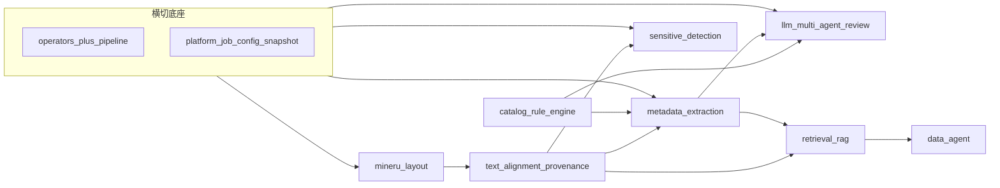

# 跨模块契约与依赖总览（IDL）

**读者**：所有参与 [highlevel_direction.md](../highlevel_direction.md) 相关开发的工程师；**牵头评审**：总负责（见 [ownership.md](../ownership.md)）。

**目的**：用一份短文档固定**模块边界**与**稳定数据结构**，使 `01`–`09` 可并行实现而少踩集成坑。

---

## 1. 与平台 API、权威设计的关系

- **HTTP 与错误格式**以 **[docs/API_CONTRACT.md](../../API_CONTRACT.md)** 为准，本文件不重复字段清单。
- 平台任务创建/查询：**API_CONTRACT** §12（`POST /api/v1/platform/v1/jobs`、`GET .../jobs/{id}`、`payload_hash` 幂等等）。
- Rulesets 制品：**API_CONTRACT** §13；执行时 **`config_snapshot` 不可变**见 **[docs/design/06_document_intelligence_platform.md](../../design/06_document_intelligence_platform.md)**。
- AI 编排抽象：**[docs/design/04_ai_pipeline_design.md](../../design/04_ai_pipeline_design.md)**（Provider、Step0–3、审计）。

本目录各模块文档只写**增量契约**；与上述冲突时，以 `API_CONTRACT` 与 `docs/design` 为准并回修本文件。

---

## 2. 模块依赖图（逻辑顺序，非代码 import）

**读图说明**：

- **横切**：`05_platform_pipeline_ray_operators.md` 描述 `spine`；所有重计算阶段最终都要落到可观测、可重试、租户可隔离的执行模型上。
- **L2（对齐/溯源）**是多个下游的**几何与文本锚点**来源；上游布局格式变更必须同步更新 L2 契约。
- **L4（编目规则）**与 **L3（抽取）**、**L6（审核 Agent）**在「规则 vs AI 谁优先」上需在实现前对齐（见下文 `rule_ai_merge_policy`）。

---

## 3. 坐标系与几何（Coord Space）

| 字段 / 概念 | 约定 | 代码参考 |
|-------------|------|----------|
| `coord_space` | 字符串枚举；**新增取值须全仓评审**（DB、前端叠加、PDF 渲染） | `document_annotations.coord_space`；`document_contracts.MINERU_LAYOUT_COORD_SPACE` |
| `bbox` | 优先 `[x0, y0, x1, y1]` 浮点，与具体坐标系文档一致 | MinerU `middle.json` span、`GeometryHit` |
| `page_index` | 0-based，与 MinerU `page_idx` 对齐 | `iter_spans_from_middle` |

**注意**：历史上存在 `mineru_pdf`（迁移默认值）与代码中 `mineru_layout` 等命名；新功能应在单模块设计文档中**显式列表**支持的 `coord_space` 及互转规则，避免静默混用。

---

## 4. 产物引用 `ArtifactRef`（与算子 I/O 对齐）

与 **[docs/OPERATORS.md](../../../docs/OPERATORS.md)** 一致：

- `kind`：如 `image_path`、`ocr_text`、`json`、`middle_json`（扩展时登记到本表）。
- `uri` 与 `inline` **二选一且非空**；大对象走 `uri` + 可选 `checksum`。
- `meta`：可放 `content_type`、页数、解析器版本等。

平台侧持久化时：引用存储路径需落在 **`STORAGE_PATH` 约定目录**内，并在 `config_snapshot` 或 job 产物记录中可重建。

---

## 5. 文本锚点与溯源（Provenance，最小字段）

供 **元数据抽取、敏感定位、RAG chunk、Multi-Agent evidence** 共用；字段可扩展，但**最小集**建议稳定：

| 字段 | 类型 | 说明 |
|------|------|------|
| `source` | string | 如 `mineru_span`、`ocr_line`、`user_selection` |
| `page_index` | int | 0-based |
| `char_start` / `char_end` | int | **页内** UTF-16 或 UTF-8 字节偏移（**全项目只能选一种，须在 02 文档锁定**） |
| `span_id` | string, optional | 稳定 ID，便于跨服务引用（若 middle.json 无 ID，可由 pipeline 生成） |
| `bbox` | float[4], optional | 与 `coord_space` 一致 |
| `quote` | string, optional | 短引用片段，便于人审 |

**并行约定**：下游模块只消费上述最小集；若只需全文字符串可先不传 `bbox`，但 **审核/高亮**路径应逐步补齐。

---

## 6. 规则命中结构（Step0 / rules_engine 友好）

与 CSV 规则扫描、敏感算子 bridge 对齐的最小结构（示例逻辑名）：

| 字段 | 说明 |
|------|------|
| `matched_text` / `phrase` | 命中片段 |
| `category` | 规则分类 |
| `agent_id` | 可选，路由到子 Agent |
| `hit_origin` | `regex` / `lexicon` / `ner` / `llm` 等 |

具体键名以 **`app/rules_engine`** 与 **`SensitiveHit`** 为准；跨模块 JSON 若需改名，应通过版本化 `config_version` 或新 API 版本发布。

---

## 7. `rule_ai_merge_policy`（编目与审核）

在 **编目规则引擎（04）** 与 **元数据抽取（03）**、**LLM 审核（06）** 之间，实现前需选定一种策略（写入各自设计文档的「并行约定」节）：

- **AI 优先**：LLM 输出为主，规则做校验/打回。
- **规则优先**：规则命中覆盖 AI 字段；AI 仅填规则未覆盖项。
- **显式仲裁**：冲突进入 Step3 或独立仲裁 Agent。

未选定前，各模块可并行**预研**，但**合并逻辑**只能有一处 SSOT（建议 Service 或平台 driver 层）。

---

## 8. 版本与租户

- **`OperatorContext.config_version`**：与 ruleset / YAML 解析版本对齐思路见 **06 设计文档**。
- **`tenant_id`**：平台头 `X-Platform-Tenant-Id`（见 **API_CONTRACT** §2.5）；存储与索引设计须避免跨租户泄漏（**08、09** 重点）。

---

## 9. 思考题

1. 若仅更新 `middle.json` 而不 bump `config_snapshot`，平台任务是否应视为新 run？为什么？
2. `ArtifactRef.checksum` 应在哪一层计算：算子出口还是存储写入后？对幂等有何影响？
